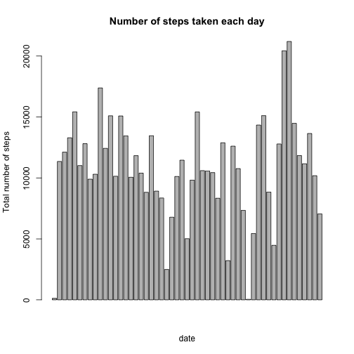
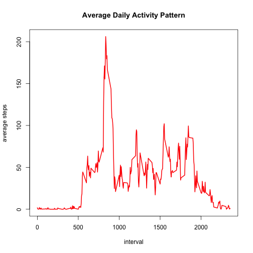
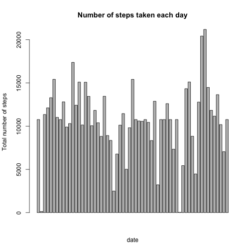
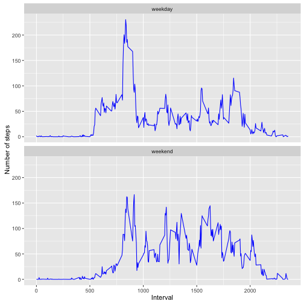

## Reproducible Research Project1


### 1. Loading and preprocessing the data:

```r
# Reading data
activity <- read.csv("./activity.csv", header = TRUE)

# Preprocessing
activity$date <- as.Date(activity$date, format = "%Y-%m-%d")
activity$interval <- as.factor(activity$interval)
```


### 2. Mean total number of steps taken per day: 
(Missing values can be ignored)

```r
# Aggregating total steps per day 
totalSteps <- aggregate(steps ~ date, activity, sum, na.rm=TRUE)

# Renameing the columns
names(totalSteps) <- c("date","steps")

# Making a histogram of the total number of steps taken each day
barplot(totalSteps$steps,
        xlab="date", ylab="Total number of steps",
        main="Number of steps taken each day")
```



```r
# Calculate and report the mean and median total number of steps taken per day
meanSteps <- mean(totalSteps$steps, na.rm=TRUE)
meanSteps
```

```
## [1] 10766.19
```

```r
medianSteps <- median(totalSteps$steps, na.rm=TRUE)
medianSteps
```

```
## [1] 10765
```
The mean of the total steps per day is 1.0766189 &times; 10<sup>4</sup> and median is 10765.


### 3. Average daily activity pattern:

```r
# Make a time series plot of the 5-minute interval and the average steps
averageSteps <- aggregate(steps ~ interval, activity, mean, na.rm=TRUE)
averageSteps$interval <- as.integer(levels(averageSteps$interval)[averageSteps$interval])

plot(averageSteps$interval, averageSteps$steps, type = "l", col = "red", lwd = 2, 
     main = "Average Daily Activity Pattern", xlab = "interval", ylab = "average steps")
```



Which 5-minute interval, on average across all the days in the dataset, contains the maximum number of steps?

```r
max <- averageSteps[which.max(averageSteps$steps),]
max$interval
```

```
## [1] 835
```

```r
max$steps
```

```
## [1] 206.1698
```
835 contains the maximum number of steps, 206.1698113.


### 4. Imputing missing values:

```r
# Calculate and report the total number of missing values in the dataset 
totalMissing <- sum(is.na(activity$steps))
```
The total number of rows with NAs is 2304.


```r
# Devise a strategy for filling in all of the missing values in the dataset. 
replaceNA <- function(steps, interval) {
        x <- NA
        if (!is.na(steps))
                x <- c(steps)
        else
                x <- (averageSteps[averageSteps$interval==interval, "steps"])
        return(x)
}

# Create a new dataset that is equal to the original dataset but with the missing data filled in.
## Used mean of the steps
replaceData <- activity
replaceData$steps <- mapply(replaceNA, replaceData$steps, replaceData$interval)

# Make a histogram of the total number of steps taken each day.
totalSteps2 <- aggregate(steps ~ date, replaceData, sum)
barplot(totalSteps2$steps,
        xlab="date", ylab="Total number of steps",
        main="Number of steps taken each day")
```



```r
# Calculate and report the mean and median total number of steps taken per day. 
meanSteps2 <- mean(totalSteps2$steps)
meanSteps2
```

```
## [1] 10766.19
```

```r
medianSteps2 <- median(totalSteps2$steps)
medianSteps2
```

```
## [1] 10766.19
```
The mean of the total steps per day is 1.0766189 &times; 10<sup>4</sup> and median is 1.0766189 &times; 10<sup>4</sup>.

Since the NAs are replaced with the mean value of the steps, the mean of the total steps per day has not been changed from the first part of the project. However, median value of the total steps per day has been slightly increased from 10765 and it is identical to mean value.


### 5. Differences in activity patterns between weekdays and weekends:

```r
# Create a new factor variable in the dataset with two levels – “weekday” and “weekend” indicating whether a given date is a weekday or weekend day.
weekFactor <- function(date) {
        day <- weekdays(date)
        if (day %in% c("Monday", "Tuesday", "Wednesday", "Thursday", "Friday"))
                return("weekday")
        else if (day %in% c("Saturday", "Sunday"))
                return("weekend")
        else
                stop("invalid date")
}
replaceData$date <- as.Date(replaceData$date)
replaceData$day <- sapply(replaceData$date, FUN=weekFactor)

# Make a panel plot containing a time series plot (i.e. 𝚝𝚢𝚙𝚎 = "𝚕") of the 5-minute interval (x-axis) and the average number of steps taken, averaged across all weekday days or weekend days (y-axis). 
replacedSteps <- aggregate(steps ~ interval + day, replaceData, mean)
replacedSteps$interval <- as.integer(levels(replacedSteps$interval)[replacedSteps$interval])

library(ggplot2)
ggplot(replacedSteps, aes(x=interval, y=steps)) + geom_line(color="blue") + facet_wrap(~ day, nrow=2) +
        xlab("Interval") + ylab("Number of steps")
```


